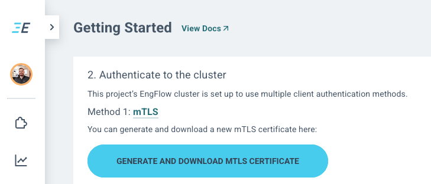

`cmake-re` supports the `--distributed --build` command line flags, scaling CMake builds to thousands of Jobs on RBE build clusters like the EngFlow platform.

This supports fully distributed :
- Compiling
- Archiving
- Linking

## Remote Execution API (RE-API)

The RE API (Remote Execution API) is an open and popular remote execution protocol to enable build and test actions to be executed on remote servers instead of local machines, making builds faster and more scalable.

Born out of Google's Blaze build system, it is an open gRPC protocol and it is now getting wider adoption outside of Blaze/Bazel. `cmake-re` implements it for CMake together with our own fork of `reclient` to remote invocations of compiler, archiver, linker, tests and custom commands.

## Usage
The build distribution only requires authentication certificates to be downloaded from the EngFlow UI and `--distributed` to be passed to the `cmake-re` command line invocations.


### Authenticate with an mTLS Certificate 

- Head in your browser to `https://<cluster-address>/gettingstarted`
- Download the mTLS certicates by clicking the Button :



This will download a file named `engflow-mTLS.zip` containing an : 
- engflow.crt
- engflow.key (_This is the private key, never share_)

#### Setup Certificates for `cmake-re`
```bash
# Setup RBE Cluster for L2 caching and remote execution
export RBE_service=<cluster-address:port>
export RBE_tls_client_auth_key=/path/to/engflow.key
export RBE_tls_client_auth_cert=/path/to/engflow.crt
```

### Build `--distributed` your CMake project 

In order to run a distributed build, you will need to declare the environment in which it runs. This is given in the form of a [_CMake RE Environment Description_](/documentation/0400-environments#custom-containerized-environments).

Mainly the `.pkr.js` file aside the CMAKE_TOOLCHAIN_FILE declares which container image to use when running the build remotely.

> #### Note on environments
> A _CMake RE Environment Description_, essentially is : 
>   - * A `CMAKE_TOOLCHAIN_FILE`, _e.g._ `environment/linux.cmake`
>   - * An accompanying `.pkr.js` and `Dockerfile`, _e.g._ `environments/linux.pkr.js/`, `environments/linux.pkr.js/linux.Dockerfile`
>
> You can use an [existing default environment](/documentation/0400-environments#default-environments) or [specify your own](/documentation/0400-environments#custom-containerized-environments).

The snappiest experience currently is with `--host --distributed` builds, this requires you to have an `--host` build environment matching remote execution, the easiest is to start the build from within the same container than the configured one in the `.pkr.js` file.

```bash
# Disable L1 caching operations
export TIPI_CACHE_CONSUME_ONLY=ON
export TIPI_CACHE_FORCE_ENABLE=OFF

# configure
cmake-re --host -S . -B ./build  -GNinja -DCMAKE_TOOLCHAIN_FILE=environments/linux.cmake
# build
cmake-re --host --distributed --build ./build -j1000
```

## RBE FAQ

> ## What if mismatching local and remote environment is required ?
> CMake RE makes it particularly hard and will warn about it when it detects mismatches.
> 
> 🧪 Advanced debugging and power-users: it's possible to override the mapping between the local environment cmake-re uses and the one use for remote build execution. This can be done by setting the `RBE_platform` environment variable: 
> ```bash
> # official linux environment for cmake-re v0.0.80
> export RBE_platform=container-image=docker://tipibuild/tipi-ubuntu@sha256:5206328aa68f666b572c4e6ce1bf1b33731a01f36c3a1a4b9a003108f9370a42
> ```

>  ## ✈️ Flight mode - How to continue working with a `--distributed --build` without internet connection ?
>  If one started working on a build tree with the `--distributed` mode but happens to have lost the internet connection (_e.g._ Working from a plane) one can disable the use of remote resources temporarily with : 
>
>  ```bash
>  export RBE_remote_disabled="true"
>  ```
> 💡 Don't forget to ajdust the number of jobs `-j` used for the build, to avoid overloading your local machine, when building with `RBE_remote_disabled`.