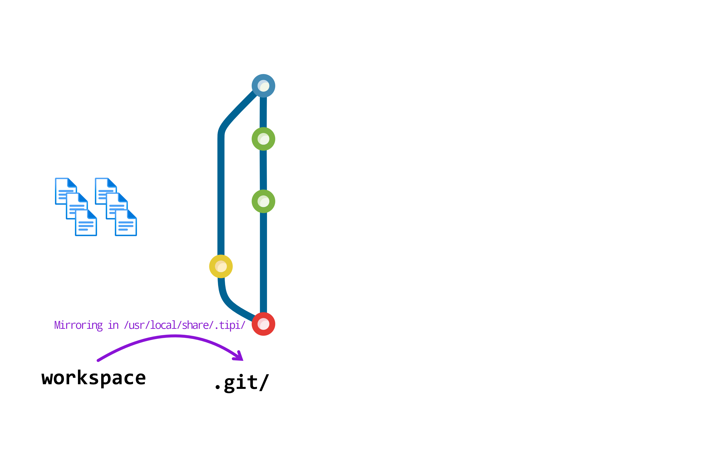
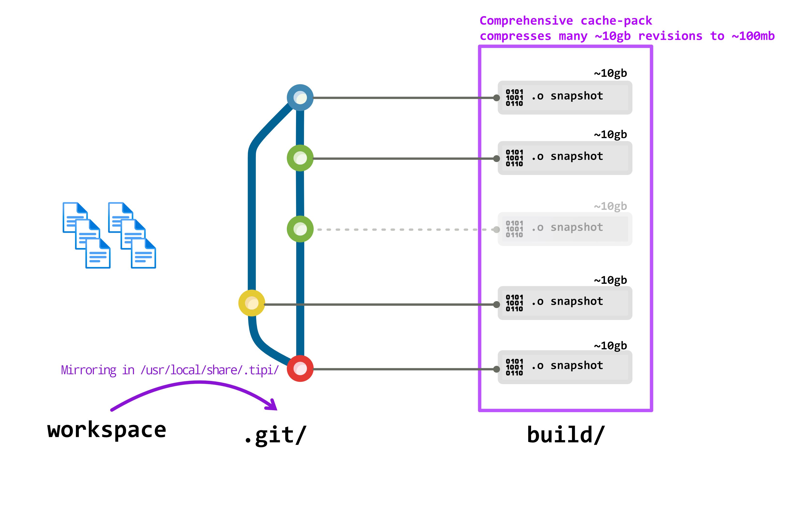
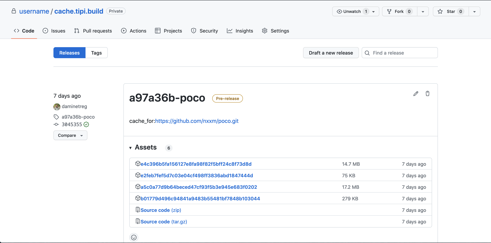

Starting from `v0.0.35` tipi provides an automatic versioning-abiding build cache **in remote builds**.

## Usage
The build cache is **enabled by _default_ both on containerized and `--remote` builds**. This means that _any_ build will benefit from automatic caching.

`cmake-re` runs containerized builds by default if `--host` is not provided.

### On `--host` builds
As on `--host` builds `cmake-re` cannot guarantee the same level of isolation and repeatability, caching is disabled by default. It can however be enabled if the user is willing to guarantee himself that the host system won't change between cache reuse.

It can hence be enabled in these contexts by defining the environment variable `TIPI_CACHE_FORCE_ENABLE=ON`.

## Rationale
C++ applications often take longer to compile than the developer has time to wait, which cause slow iteration cycles and thus reduce developer productivity. A common solution is to tighten the scope of the build: consuming dependencies as pre-compiled libraries. This, however, increases the risk of version and ABI mismatches, and thus of shipping bugs to production.

With `cmake-re` we decided to provide a solution based on __maximizing building from source__  with the same toolchain flags to ensure full correctness of the resulting apps, while __maximizing cached builds__ to improve developer iteration cycles: fast+correct.

Each git revision is cached incrementally in a space efficient _comprehensive pack_ file combining the advantages of pre-built binaries and build from sources.

## Source mirroring



tipi achieves cacheable, correct and repeatable builds for any codebase with caching by relying on the tipi source mirroring mechanisms. This avoids the requirement of required relocatable build or install tree for source code with manually written build scripts and avoids the necessity to patch cached files on extraction.

Whenever you launch a build, tipi will produce a mirror of your sources either locally or remotely. This mirroring uses git but also takes in account your uncommitted or ignored data.

If you want to fully ignore data for the build you can add them to the `.tipiignore` file.


## Comprehensive packs


The cache mechanism first queries the global `cache.tipi.build` storage. If the code has already been built by a secure tipi.build cloud runner for the same compiler and set of flags ( i.e. So-called _ABI-hash_ ) the cache is pulled from the global build cache.

The global `cache.tipi.build` contains a curated list of open-source projects cached for the default toolchains delivered by tipi.

If the project has never been built by tipi.build or is private, a build is started and the build is made in isolation and stored in the user private build cache. The cache is always stored privately linked to the user source code hosting account under the repository `username/cache.tipi.build` (tipi creates this repository as private repository automatically when the cache is active).



Each _comprehensive pack_ are stored as releases artifacts for each platform, identified by the cache-id that tipi computes from the git repository *origin* URL and that can be overridden via the [`.tipi/id`](#cache-id-file) file.

### Cache id file
`cmake-re` automatically computes a cache identified when building a project based on the git origin, it's possible to override this with a `.tipi/id` file intended to be checked-in the repository and identifies the project cache-id, the resulting id is the `sha1-hash(<host + organization name>)-<project name>`.

For instance a repository that was cloned from `github.com/tipi-build/simple-example` will have a cache-id of `40999a5-simple-example` influenced by the following `.tipi/id`.
```json
{
  "host_name":"github.com",
  "org_name":"tipi-build",
  "repo_name":"simple-example"
}
```

This id can then be found in the tipi source mirroring directory ( i.e. Unixes : `/usr/local/share/.tipi/w` , Windows : `C:\.tipi\w` )

