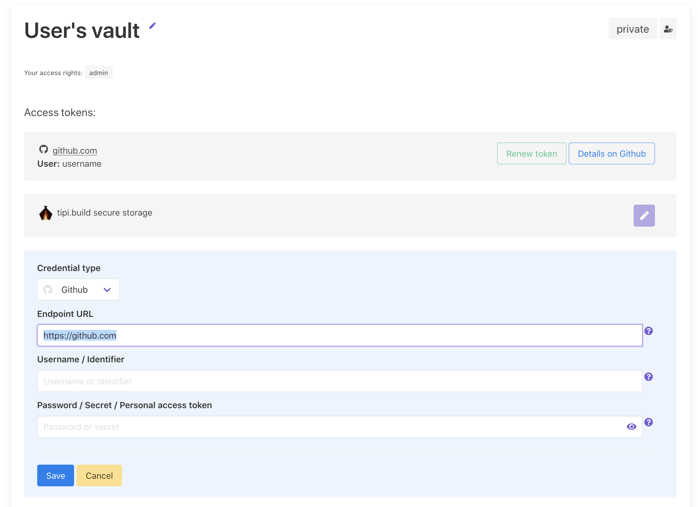

Both your local _tipi_ CLI installation as well as your [tipi.build](https://tipi.build) cores and nodes require access to your tipi
account to be able to access private repositories and your subscription information.

In order to enable a friction-less usage _tipi_ comes with a credentials store dubbed _tipi vault_ which is essentially a zero-knowledge encrypted storage linked to your account.

## Creation of the vault

During the on-boarding on [tipi.build](https://tipi.build) you will be asked to create said _vault_ and to provide a passphrase for it. That passphrase is used during the browser session to encrypt the vault and is never sent to our servers.

In the following on-boarding steps you will be given the opportunity to grant your account access to private
repositories on GitHub.com which is required if you want to consume privately listed dependencies. 

That access can be granted at any time using the [vault dashboard on tipi.build](/dashboard/vault).

## Authenticating to tipi.build with `tipi` CLI

Run the `tipi connect` command and follow the instructions. 
You will be prompted with a link to authenticate the device on tipi.build. After confirming the access to your vault the CLI will ask for your _vault passphrase_.

> For private cloud and on premise users: you can connect to your private deployment of tipi.build by specifying the `TIPI_ENDPOINT` environment variable

## Authentication in Continuous Integration context

On non-interactive usages of `tipi` credentials can be provided by setting the following environment variables: `TIPI_ACCESS_TOKEN`, `TIPI_REFRESH_TOKEN`, `TIPI_VAULT_PASSPHRASE`.

## Authentication with a Personal Access Token on GitHub

tipi.build grants access to your repositories automatically during the on-boarding. 

However if you want to grant different access level to repositories from an organization, from another account or that weren't authorized yet to use tipi.build you can add a [GitHub Personal Access Token](https://docs.github.com/en/authentication/keeping-your-account-and-data-secure/creating-a-personal-access-token) to your vault. 

The personal access token are secured by the vault and are only used by you on your local tipi builds or by the short-lived remote build instances. 

1. Create a [GitHub Personal Access Token](https://docs.github.com/en/authentication/keeping-your-account-and-data-secure/creating-a-personal-access-token)
2. Open your [tipi.build secure vault](/dashboard/vault)
3. Unlock the vault (this happens in your browser, nothing is transmitted to tipi.build)
4. Add your Personal Access Token credentials by adding an additional `https://github.com` or any GitHub Enterprise endpoint.

Now with the `tipi` CLI you can refresh your authentication data with `tipi connect`.
