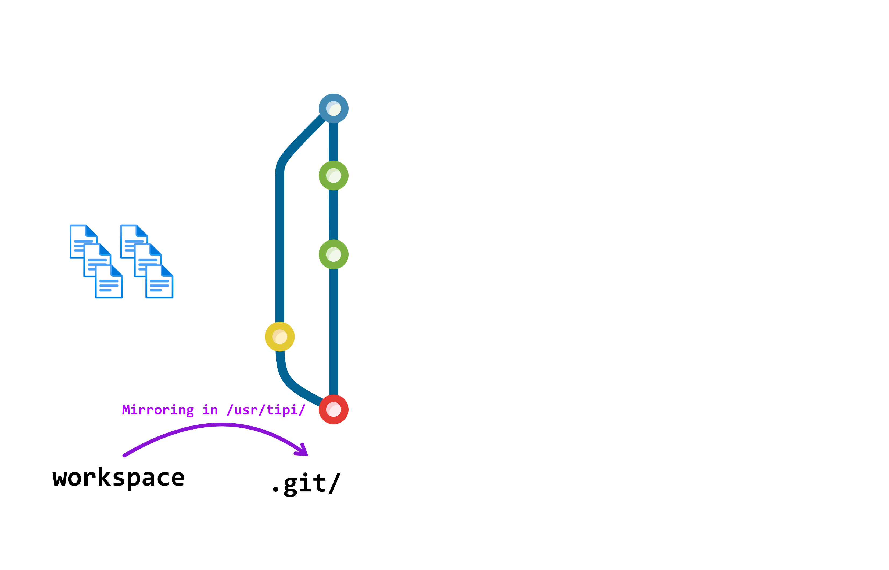
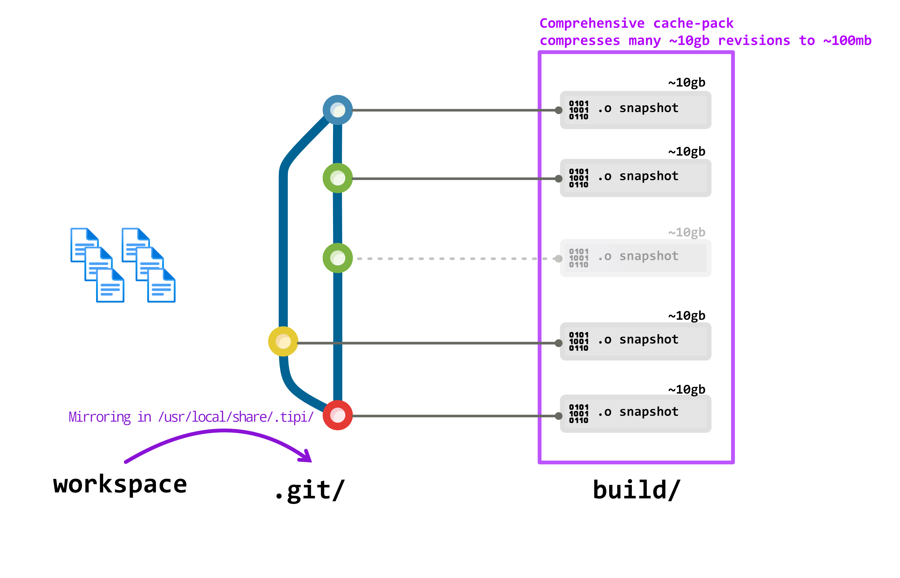
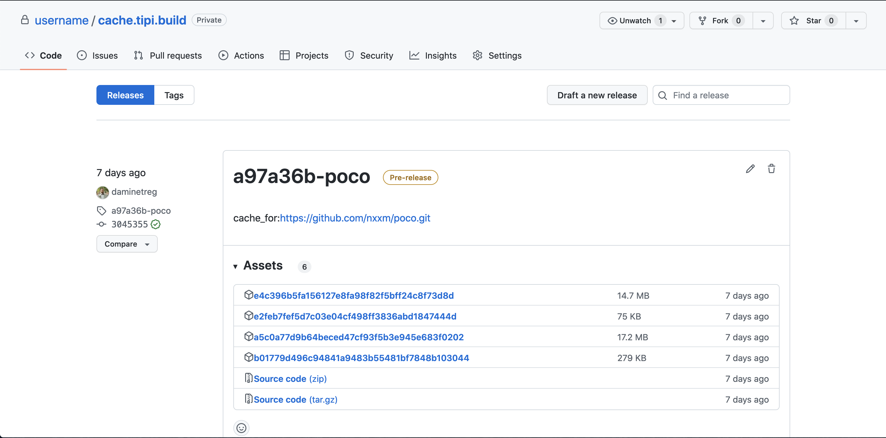

Starting from `v0.0.35` tipi provides an automatic versioning-abiding build cache **in remote builds**. 

## Usage
The build cache is **enabled by _default_ on remote builds**. This means that _any_ build executed on tipi.build cloud machines will benefit from automatic caching: see [how to build for different targets in the *tipi build cloud*](/explore/remote-build).

### On local builds
For the moment we advice to use remote builds to benefit from the cache and not to use caching on local builds as we cannot provide the same level of isolation and repeatability.

However we are working on this and you can enable the preview feature (at your own risks) by setting the environment variable : `TIPI_CACHE_FORCE_ENABLE=ON`.

## Rationale
C++ applications often take longer to compile than the developer has time for, which cause slow iteration cycles and thus reduces developer productivity. A common solution is to tighten the scope of the build: consuming dependencies as pre-compiled libraries. This, however, increases the risk of version and ABI mismatches, and thus of shipping bugs to production.

At tipi we decided to provide a solution based on __always building everything from source__ with the same tool-chain flags to ensure full correctness of the resulting apps.

This naturally alone would results in correct but very slow compilation. That's why tipi.build provides a Global Build Cache connected to revision control.

Each git revision is cached incrementally in a very space efficient _comprehensive pack_ file combining the advantages of pre-built binaries and build from sources. 

## Source mirroring



tipi achieves cacheable, correct and repeatable builds for any codebase with caching by relying on the tipi source mirroring mechanisms. This avoids the requirement of required relocatable build or install tree for source code with manually written build scripts and avoids the necessity to patch cached files on extraction.

Whenever you launch a build tipi will produce a mirror of your sources either locally or remotely. This mirroring happens with git by also taking in account your uncommitted or ignored data for the build hash.

If you want to fully ignore data for the build you can add them to the `.tipiignore` file.


## Comprehensive packs


The cache mechanism first queries the global `cache.tipi.build` storage. If the code compiled has already been built by a secure tipi.build cloud runner for the same compiler and set of flags ( i.e. So-called _abi-hash_ ) the cache is pulled from the global build cache. 

The global `cache.tipi.build` contains a curated list of open-source projects cached for the default tool-chains delivered by tipi.

If the project has never been built by tipi.build or is private, a build is started and the build is made in isolation and stored in the user private build cache. The cache is always stored privately linked to the user source code hosting account under the repository `username/cache.tipi.build` (tipi creates this repository as private repository automatically when the cache is active).



Each _comprehensive pack_ are stored as releases artifacts for each platform, identified by the cache-id that tipi computes from the git repository *origin* URL and that can be overridden via the [`.tipi/id`](#cache-id-file) file.

### Cache id file
tipi automatically generates a `.tipi/id` file when building a project, this file is intended to be checked-in the repository and identifies the project cache-id, the resulting id is the `sha1-hash(<host + organization name>)-<project name>`.

For instance a repository that was cloned from `github.com/tipi-build/simple-example` will have a cache-id of `40999a5-simple-example` influenced by the following `.tipi/id`.
```json
{
  "host_name":"github.com",
  "org_name":"tipi-build",
  "repo_name":"simple-example"
}
```

This id can then be found in the tipi source mirroring directory ( i.e. Unixes : `/usr/local/share/.tipi/w` , Windows : `C:\.tipi\w` ) 

