tipi.build is a SaaS deployment of CMake RE L1 remoting.

# CMake RE - Private Cloud Deployment - Security Model
_Version v2024-05b_

## Private Cloud Deployment
In CMake RE private-cloud deployments, everything is hosted and served in full-isolation within the customer private cloud account ( e.g. AWS VPC, Azure VNet	 ).

The following deployment diagram present the different components and the protocols used for the communication :

### General Components of CMake RE
* CMake RE Access Point & Dashboard is a set of Containerized micro-services
  - `api/build` : Deploys and Destory developer machines digital twins
  - `api/accounts`: Identifies users and issues JWT Tokens
  - `app-frontend` : Provides Web Portal
  - `PostgreSQL` : Tracks machine states, authorized machine types, user ids and machines audit trail

* CMake RE L1, L2 Build Caches are S3 Storages of produced build artifacts
* `Build Cluster (Spot Instances)` are virtual machines started on demand with at least 2 Schedulers nodes always on

### Deployment Details on Amazon AWS
On AWS the generic components are also present.
 * _Amazon CloudWatch_
 *	Global Secrets provided via Amazon _AWS Systems Manager Parameter Store_
    -	_e.g._ AWS API Key to deploy developer-pc digital twins
 * _Amazon Elastic Container Registry_ is used to store Container base images 

#### L1 Remoting & Cache
 * _Amazon Full EC2 isolated instances_ deployed on demand as developer-pc digital twin
 * CMake RE L1 Build Cache as Amazon S3 Bucket

#### L2 Remoting & Cache
 * _Amazon RDS database_
 * _Amazon Elasticache Redis_
 * _Amazon EC2_ Virtual Machine in the role of the Scheduler and Runner nodes
 * CMake RE L2 Build Cache as Amazon S3 Bucket

#### CMake RE Access Point & Dashboard
*	Deployed with amazon-ecs-cli as _Amazon Elastic Container Service (ECS)_ on it’s own ECS Cluster

## External Services
CMake RE **doesn't use any third party services** or cookies to track users and it doesn't share any user data to a separate analytics platform or third parties.

The CMake RE web platform is a fully custom implementation and does not rely on 3rd party services. The data logged is anonymized and aggregated is used only for short-term debugging purposes. 

Essentially CMake RE services can run fully isolated from any outside internet services.

## Authentication 
External OIDC providers are used to authenticate users, and CMake RE Dashboard only asks access to the user name and email. These information are stored in the service database along with a generated unique identifier to authenticate actions on the service.

These OIDC providers can be an internal self-hosted service or an external cloud service like Google, Github, Gitlab. 

Out of this identification managed by `api/accounts`, Json Web Tokens are issued with asymmetric cryptographic signatures to authorize the users on the different services that makes up the solution.

### Authentication and Communication

A typical User interaction with CMake RE consists in three main steps :
1. Dashboard Login and Identity Creation
2. Local Developer Machine Pairing
3. Remote Build Execution

All communications are secured either with TLS or SSH and authenticates users with JWT Tokens and local-machine generated Private + Public Key pairs.

See more hereafter in the Sequence diagram.

#### OIDC and JWTs
The authentication and identification is essentially managed via an externally provided OIDC Identity Provider (OpenID Connect) to create an account in the CMake RE Dashboard via `api/accounts`.
 `api/accounts` then yields multiples JWTs (JSON Web Token) that are always by pairs of access and refresh token.
  - One set of JWTs authenticates to CMake RE L1 Remoting and L1 Build Cache
  - Another set of JWTs authenticates to the CMake RE L2 Remoting and L2 Build Cache

#### Access + Refresh Token : Expiration Policy 
The access tokens can be used without communication to CMake RE `api/accounts` for a given timeout based on their signature validity ( Default of 15mins ) and needs to be refreshed towards `api/accounts` every time this timeout expires thanks to the refresh tokens.

`api/accounts` then validates the user authorized access to issue a new access token.

#### Sequence Diagrams

Diagrams show used Protocols and Authentication mechanisms between components and parties within `[]` like `[TLS][JWT]` means TLS protocol with JWT based authentication, where `[SSH][SSH Private Key 🔴]` means SSH secured connection with asymetric cryptography authentication.

##### 1. Dashboard Login and Identity Creation

##### 2. Local Developer Machine Pairing

##### 3. Remote Build Execution

```mermaid
sequenceDiagram
    participant User
    participant Web Browser
    participant Local Machine

    participant api/accounts

    User ->> Local Machine: cmake-re --build --remote
    Local Machine ->> Local Machine : 🔄 Generate SSH Private Key 🔴 + Public Key 🟢
    Local Machine ->> api/build: [TLS][JWT] Send SSH Public Key 🟢
    api/build ->> Private Cloud Account : Create Isolated Virtual Machine
    Private Cloud Account ->> digital-twin : Start SSH Service with SSH Public Key 🟢
    digital-twin -->> Private Cloud Account: 
    Private Cloud Account -->> api/build : Machine ready
    api/build -->> Local Machine: FQDN Hostname of developer-pc digital twin
    Local Machine ->> digital-twin : [SSH][SSH Private Key 🔴] Send 🔓 decrypted vault + JWT Tokens
    digital-twin ->> CMake RE L1 Cache : [TLS][JWT]
    CMake RE L1 Cache -->> digital-twin : Cached Build Tree
    digital-twin ->> CMake RE L2 Cluster : [TLS][JWT]
    CMake RE L2 Cluster ->> CMake RE L2 Cache: [TLS][JWT]
    CMake RE L2 Cache -->> CMake RE L2 Cluster: [TLS] Cached Action
    CMake RE L2 Cluster -->> digital-twin : Build result
    digital-twin -->> Local Machine : Build Log
    api/build ->> digital-twin: Stop + Delete machine
    Local Machine ->> CMake RE L1 Cache : [TLS][JWT] JWT Tokens
    CMake RE L1 Cache -->> Local Machine : Cached Build Tree
```

## Build Cache Access Rights
Cache visibility and access right is by default private by user, so that by mistake nothing gets shared to any other users and can be configured to be shared by repositories and groups of users.

## Source Code and Build Remoting
To guarantee full data privacy and security the general CMake RE Access Point & Dashboard has no access to the user's source code, only interactive or CI build sessions on short-lived developer-pc digital twin actually have the source code.

A developer-pc digital twin is a short-lived instance to run builds remotely ( _i.e._ A freshly provisioned virtual machine started on demand in the customer private cloud account ).

It is started for the current build session, individual to each user and gets the source code transferred to it directly from client build requests.

Short lived build runner get destroyed at the end of the build session and cleaned up after a configurable timeout.

The developer-pc digital twin remote build runner is made accessible only trough asymetric cryptographics keys for the SSH Protocol generated on each new build session, which means that only the local machine sending the source code and initiating the session has the data to access the short-lived remote build machines and the decrypted sources.

The tokens to the source code hosting solution are exchanged from the Local Machine to the digital-twin via cmake-re encrypted vault technology over TLS.

## Secure access token storage 
On the first registration CMake RE users are asked to create a so-called vault. The vault is a cryptographically secure container that stores access tokens to user's private repositories hosted elsewhere ( e.g. Internal Gerrit, Gitlan, Github… ).

These tokens are encrypted and decrypted using the user's vault passphrase by an open source C++ client-side only software library that is run in webassembly in the browser and natively in the build nodes. The vault passphrase is never shared to the cloud service.

The vault is uploaded by the user's browser as a purely encrypted binary blob, which means that even if the CMake RE database gets compromised, it will only provide to an attacker user emails and encrypted blobs of token using state-of-the-art cryptography algorithm.

No serious attacker would actually choose this road, as the encrypted token after such a databreach could just be revoked.

_With the vault authentication data is only known by the local browser or the user’s machine running the build._

## Computer Pairing
To use remote compilation and execution capabilities, it is possible to locally save a vault for use on the user computer. That means if the computer is attacked or at risk, the tokens in the vault might get stolen ( they are not saved in clear-text though ).

If an user ever suspect that his computer was subject of an attack or a data breach, it is possible to revoke access anytime and regenerate the vault and it's tokens.

_CMake RE : revoke local machines access tokens_

## Software Updates : Security 
Security Updates are rolled-out based on a severity basis, the CMake RE Team watches vulnerability databases and notifies customers of new software updates, this mainly means updating container images and restarting services.

## Website data
The first data tipi.build gets are from visitors and user of the tipi.build web-app. As you might have noted, tipi doesn't require submitting cookie preferences. It's because we don't use any third party cookies to track users and tipi doesn't share any user data to a separate analytics platform or third parties.

The tipi.build web platform is a fully custom implementation and does not rely on 3rd party services (except for cloud server hosting obviously). The data that we log is anonymized and used only for short-term debugging purposes.