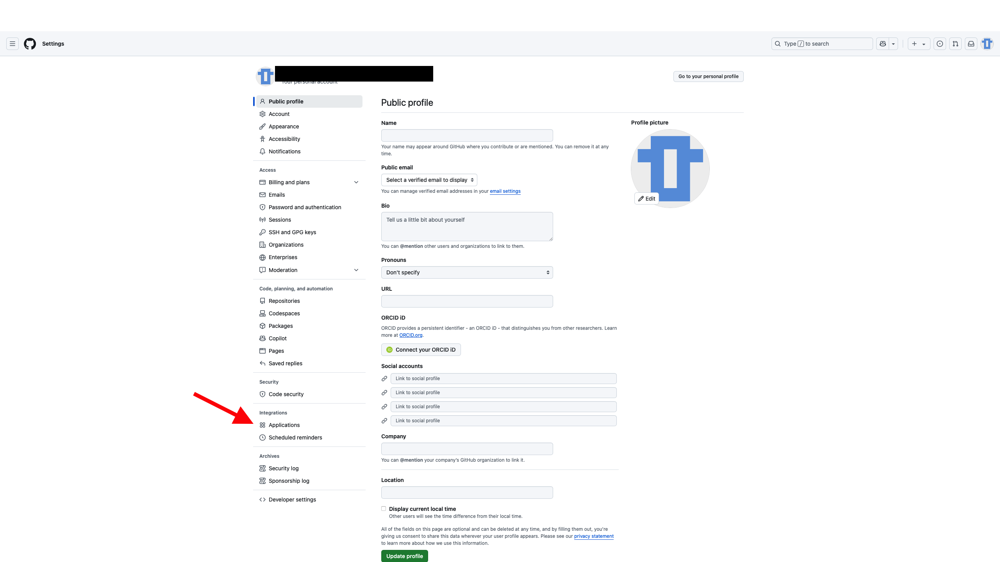
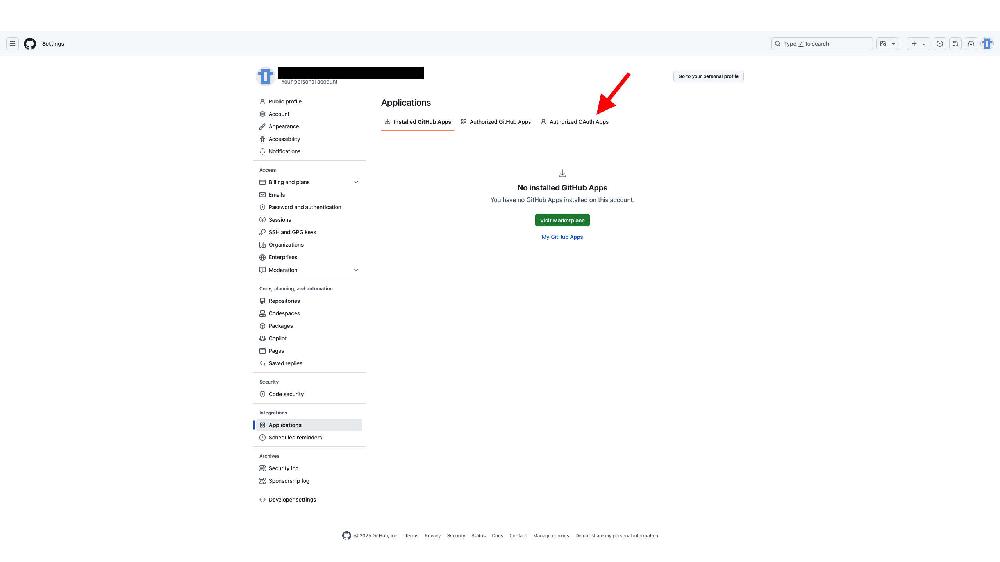

## Connection error between GitHub and tipi

In some cases, tipi may not be able to retrieve your GitHub profile to authenticate you.
To solve this problem, you need to delete the tipi authorization in GitHub. 
Then redo all tipi authentication (authentication documentation: [here](/documentation/0600-authentication)).

how to delete tipi's authorization on GitHub:
 1) go to: [github.com](https://github.com)
 2) Log into your github account
 3) go to your [profile settings](https://github.com/settings/profile) 
 4)  Now click on application: 
 
 5) Click on Authorized OAuth Apps:

 
 6) Revoke tipi.build access
